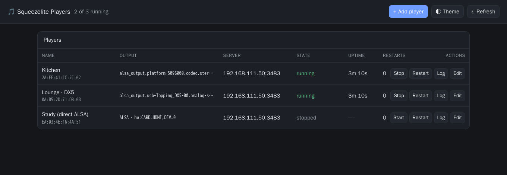
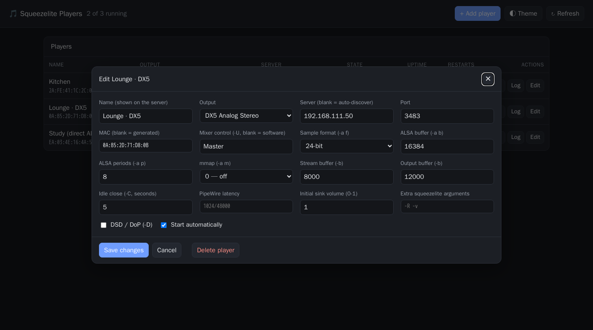
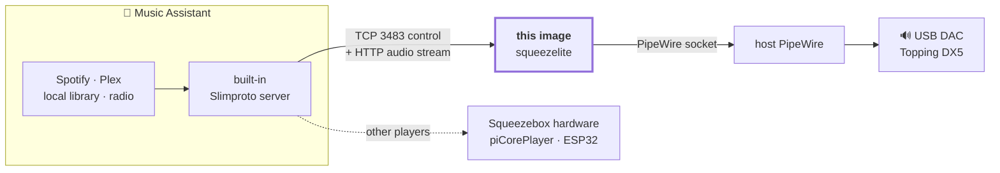

# Squeezelite-PipeWire (Hi-Fi Edition)

> **Part of the [Home Audio Stack](https://github.com/shuricksumy/home-audio-stack)** — Music Assistant → Snapcast → PipeWire, into USB DACs, Bluetooth speakers and LED strips. That page maps how these projects fit together.

This repository provides a high-performance Squeezelite Docker container optimized for PipeWire and bit-perfect audio delivery. It is specifically pre-configured for high-end DACs like the Topping DX5, supporting sample rates up to 384kHz and DSD.

[](https://github.com/shuricksumy/pipewire-squeezelite/actions/workflows/build.yml)

<p align="center">
  <a href="#panel"></a>
  <br><sub><b>Run the image and open port 8080.</b> Add a player, pick its DAC, press
  Start — no compose editing, no SSH. Each row is its own supervised squeezelite
  process. <a href="#panel">More about the panel ↓</a></sub>
</p>

<p align="center">
  
  <br><sub>Every knob that matters is a field: sample format, buffers, idle close,
  the mixer control, DSD — not hidden behind "advanced".</sub>
</p>

## ✨ What you get

|  | |
| :-- | :-- |
| 🎯 **Bit-perfect, genuinely** | The DAC follows each track: 44.1, 96, 192 kHz, 16- or 24-bit. Nothing is converted to one house format on the way. |
| 🎼 **DSD too** | Decoded natively, or passed through as DoP. |
| 🔊 **Hardware volume** | Handed to the PipeWire mixer, not attenuated in software where it costs you bits. |
| 🏠 **It is just a room** | Music Assistant drives it through its Squeezelite provider, so it appears next to every other player. |

<p align="center">
  
  <br><sub>And it stays bit-perfect: a Tidal FLAC at 192 kHz / 24 bits reaching the DAC
  unchanged — the <a href="#check-hardware-clock-the-truth">kernel agrees</a>,
  <code>rate: 192000</code>, DAC clock 191998 Hz.</sub>
</p>

**Running more than one room?** The [Home Audio Stack](https://github.com/shuricksumy/home-audio-stack) has a [complete compose file](https://github.com/shuricksumy/home-audio-stack/tree/main/examples) with this image alongside the others.

## 🎯 Why this exists

[**Music Assistant**](https://www.music-assistant.io/) is the library and streaming brain — Spotify,
Plex, local files, radio — and Home Assistant drives it. What it cannot do on its own is put audio
into a **USB DAC plugged into some other Linux box**, at the original sample rate, with the volume
landing on the real hardware.

Music Assistant covers the protocol half: it emulates a Logitech Media Server and implements
the full [Slim protocol](https://github.com/music-assistant/aioslimproto), so any squeezelite player
on the network becomes a player it can drive — see its
[Squeezelite provider](https://www.music-assistant.io/player-support/squeezelite/).

**This image is the player for the hi-fi end of that chain.** It plays into the host's PipeWire
session instead of grabbing an ALSA device, so the DAC follows the source rate (44.1 kHz stays
44.1 kHz, no resampling), DSD is decoded natively or passed through as DoP (`-D`), and volume is
handed to the PipeWire mixer with `-U Master` rather than being attenuated in software.



### Use it with Music Assistant

Add the provider in MA — `Settings → Player Providers → Add a New Provider → Squeezelite` — and
leave the port at the default **3483**. Then point this container at the MA host:

```yaml
environment:
  - PLAYER_NAME=Lounge-DX5          # the name you will see in Music Assistant
  - SERVER_IP=192.168.1.50:3483     # your Music Assistant host
  - MAC_ADDR=72:23:90:88:38:63      # unique per player -- MA keys settings off it
```

The player appears in MA's player list, usually within a minute. Discovery is automatic on the same
network, so `SERVER_IP` is really there to pin the choice — which is what you want if MA sits on
another subnet, or if an LMS is also running and would otherwise grab the player first.

| | |
| :-- | :-- |
| **Codec** | MA streams FLAC by default (MP3, AAC and WAV are also selectable). All four decode natively here, so nothing is transcoded twice. |
| **Volume** | Squeezelite has no native mute, so MA offers a "fake mute". This image sidesteps it: on start it unmutes the hardware sink and sets it to `INIT_VOL` through `wpctl`. |
| **One server at a time** | A slimproto player can only hold one server connection. If it never shows up in MA, check it is not still attached to an LMS. |

**Prefer the classic?** [Lyrion Music Server](https://lyrion.org/) (formerly Logitech Media Server, "LMS")
speaks the same protocol on the same port — point `SERVER_IP` at it instead and nothing else changes.


## Features

- Bit-Perfect Audio: Configured to switch sample rates (44.1k - 384k) automatically to match source material.

- PipeWire Native: Uses the modern PipeWire audio engine for low-latency routing and superior volume management.

- Full Codec Set: FLAC (incl. Ogg FLAC), AAC, MP3, Vorbis, Opus and DSD (native + DoP), with soxr resampling and HTTPS stream support compiled in.

- Multi-Arch Support: Builds for both amd64 (PC) and arm64 (Raspberry Pi).

- Unprivileged: Runs as uid/gid 1000, not root - see [Verify the host is ready](#5-verify-the-host-is-ready).

- Self-Healing: The entrypoint restarts squeezelite with exponential backoff (5s -> 60s) if it exits, instead of relying on a container restart.

- Maintained Image: Rebuilt weekly so Debian security updates land without a commit, scanned with Trivy on every push, and the squeezelite submodule is checked daily against upstream.


## 🛠️ Host Setup (Preparation)

The container does **not** run its own PipeWire daemon - it connects to the host's through the
bind-mounted socket. So the host has to be a working PipeWire machine first: run these steps in
order, then use the [readiness check](#5-verify-the-host-is-ready) at the end before starting the
container.

> **Shortcut:** [`ubuntu-pipewire-install-on-host.sh`](ubuntu-pipewire-install-on-host.sh) performs
> steps 1-5 for a dedicated user, verifies the socket, and prints the compose settings for your
> host: `./ubuntu-pipewire-install-on-host.sh <username>` (default user: `dietpi`).

### 0. Prerequisites

Docker Engine plus the Compose plugin ([install guide](https://docs.docker.com/engine/install/)),
and the uid of the user whose PipeWire session the container will attach to. Note it now - the
same number appears in the socket path *and* decides whether you need a `user:` line in compose:

```bash
id -u    # usually 1000
```

### 1. Install PipeWire & Tools

```bash
sudo apt update && sudo apt install -y \
    pipewire pipewire-audio pipewire-pulse pipewire-alsa \
    wireplumber alsa-utils rtkit
```

> **Note:** the real-time helper package is `rtkit`, **not** `rtkit-daemon` - no such package
> exists on Debian or Ubuntu, and apt aborts the entire command on one unknown name, so a single
> typo leaves nothing installed. Likewise `pipewire-audio` is the current name of what used to be
> `pipewire-audio-client-libraries`.

### 2. Add your user to the audio groups

`usermod -aG` is all-or-nothing: if **any** listed group does not exist it exits with an error and
adds *none* of them. `bluetooth`, `render`, `pulse-access` and `docker` only exist once their
package is installed, so add whichever are actually present:

```bash
for g in audio video render bluetooth lp docker; do
    getent group "$g" >/dev/null && sudo usermod -aG "$g" "$USER"
done

# Group membership only applies to new sessions -- log out and back in, then verify:
id -nG
```

### 3. Configure Bit-Perfect Output

To allow your DAC to switch sample rates without resampling, create a configuration override for PipeWire:

```bash
mkdir -p ~/.config/pipewire/pipewire.conf.d/
cat <<EOF > ~/.config/pipewire/pipewire.conf.d/bitperfect.conf
context.properties = {
    # Rate used while nothing is playing; PipeWire switches to the source rate on demand
    default.clock.rate          = 48000
    # Trim this list to the rates your DAC actually supports
    default.clock.allowed-rates = [ 44100 48000 88200 96000 176400 192000 352800 384000 ]
    default.clock.min-quantum   = 32
    default.clock.max-quantum   = 8192
}
EOF

systemctl --user restart pipewire pipewire-pulse wireplumber
```

### 4. Keep the audio stack running headless

On a server, the user's PipeWire services only start when that user logs in. Lingering keeps them
up so the DAC is available to the container across reboots and logouts:

```bash
# 1. Keep this user's services running when nobody is logged in.
#    This is also what makes systemd create and keep /run/user/<uid>/, which is
#    where the socket the container mounts lives.
sudo loginctl enable-linger "$USER"

# 2. Enable and start the audio services for the user session.
#    The '--user' flag is mandatory here.
systemctl --user enable --now pipewire.socket pipewire.service \
    pipewire-pulse.service wireplumber.service

# 3. Verify the services are running
systemctl --user status pipewire wireplumber --no-pager
```

When driving these from a root shell or a cron job rather than your own login session, point the
tools at the right bus first:

```bash
export XDG_RUNTIME_DIR="/run/user/$(id -u)"
export DBUS_SESSION_BUS_ADDRESS="unix:path=${XDG_RUNTIME_DIR}/bus"
```

### 5. Verify the host is ready

All four of these must pass **before** you start the container - every one of them is something the
container itself cannot fix:

```bash
# a) The socket the container bind-mounts exists and belongs to you.
#    This exact path goes in the compose 'volumes:' entry.
ls -l /run/user/$(id -u)/pipewire-0

# b) WirePlumber sees your DAC. Note the sink name -- a substring of it is PLAYER_NAME.
wpctl status

# c) The exact node.name for PIPEWIRE_NODE
pw-cli ls Node | grep -E 'node.name|node.description'

# d) Audio actually reaches the DAC (you should hear it)
speaker-test -c 2 -t sine -l 1
```

Then wire the results into your compose file:

| Check | Goes into |
| :-- | :-- |
| `id -u` (e.g. `1000`) | the socket path, plus `user: "<uid>:<gid>"` if it is **not** 1000 |
| socket path from (a) | `volumes: - /run/user/1000/pipewire-0:/tmp/pipewire-0` |
| sink name from (b) | `PLAYER_NAME` (substring is enough) |
| `node.name` from (c) | `PIPEWIRE_NODE` |

The image runs as uid/gid **1000**. If the user that owns the socket in (a) has a different uid,
add `user: "<uid>:<gid>"` to the service or the container will start but never reach PipeWire -
the entrypoint logs `PipeWire socket not found` and playback stays silent.

## 🎧 Bluetooth Hi-Fi Playing Guide

### Install the Core Engine

This installs the Bluetooth daemon, the ALSA bridge, and the management utilities.
```Bash
sudo apt-get update
sudo apt-get install bluetooth bluez bluez-tools alsa-utils
```

### Manage Devices (The "Lazy" TUI)

- Install go pacakge ```https://github.com/bluetuith-org/bluetuith``` or use from ``` utils ``` folder 

- Instead of complex commands, use the Go-based TUI to scan and pair:
```Bash
# Start the manager
~/go/bin/bluetuith
```
- Identify Node Names
Use this to find the Permanent Name of your FiiO, JBL, or Topping DX5:
```Bash
pw-cli ls Node | grep -E 'node.name|node.description'
```

- Set in docker compose your node like
```
- PIPEWIRE_NODE="bluez_output.20_18_12_00_07_C4.1"
```

<a id="panel"></a>

## 🎛️ Web panel (ROLE=panel)

Editing compose and redeploying for every player gets old fast — especially with
several DACs on one host. The panel is what the image runs by default: pick a
PipeWire sink, name the player, press Add. It launches straight away and the panel
keeps it alive. (Set `ROLE=player` for the original single-squeezelite-from-
environment behaviour instead.)

```bash
mkdir -p ./panel_config && sudo chown -R 1000:1000 ./panel_config
docker compose -f docker-compose-panel-example.yaml up -d
# then open http://<host>:8080
```

What it does:

- **Lists the host's PipeWire sinks** (`pw-dump`), so binding a player to the
  right DAC is a dropdown rather than a `pw-cli ls Node | grep` session.
- **Runs several players in one container**, each a supervised `squeezelite`
  child with its own `PIPEWIRE_NODE` — one per DAC, no container per player.
- **Exposes the knobs that matter** rather than hiding them: sample format
  (`-a` 16/24/24_3/32), buffer and period, stream/output buffers (`-b`), idle
  close (`-C`), DSD/DoP (`-D`) and the mixer control (`-U`).
- **Supervises**: crash or server outage restarts with the same 5s→60s backoff
  the single-player role uses, and the delay resets after a session that stayed
  up, so an outage from this morning does not cost 60s tonight.
- **Watches the sink, not just the process.** A DAC that disappears mid-stream
  does not necessarily take squeezelite with it, which would leave a player that
  looks healthy and cannot make a sound. The sink is polled while running and
  the player restarts after ~15s of absence — long enough that a sample-rate
  switch is not mistaken for a failure.
- **Tails each player's log** in the browser.

### Output: PipeWire or straight to ALSA

The Output dropdown offers both:

- **PipeWire** — the sinks `pw-dump` reports, which is the bit-perfect path and
  the reason this image exists. Each player binds to one sink through its own
  `PIPEWIRE_NODE`.
- **ALSA** — the devices `squeezelite -l` reports (`hw:CARD=DX5,DEV=0`,
  `default`, …), addressed directly with `-o`. This is the way out when PipeWire
  is broken, not set up, or simply not wanted on that host: squeezelite talks to
  the hardware itself and nothing needs a running PipeWire session.

For the ALSA path the sound hardware must be passed as **devices**, not as a
volume:

```yaml
devices:
  - /dev/snd:/dev/snd      # not  volumes: - /dev/snd:/dev/snd
```

`-v /dev/snd:/dev/snd` maps the device nodes but leaves the container's device
cgroup blocking them, so squeezelite fails with `No such device` and the panel
lists only conversion plugins (`lavrate`, `speexrate`, …) with no `hw:CARD=…`
entries at all. The panel warns when it sees exactly that. If your devices still
do not appear, the Output dropdown has a **Custom ALSA device…** entry for
typing one in by hand.

A player on an ALSA output is not sink-watchdogged — there is no PipeWire graph
node to watch, and squeezelite reports device loss itself.

### Running several players on one host

They can all live in this one container, on one IP. **Music Assistant identifies
a slimproto player by its MAC and nothing else** — see
[`aioslimproto/client.py`](https://github.com/music-assistant/aioslimproto/blob/main/aioslimproto/client.py):

```python
def player_id(self) -> str:
    """Return mac address of the player (used as player id)."""
```

So players sharing one MAC collapse into a single entry that the instances fight
over — the usual symptom of copying a compose file and leaving `MAC_ADDR`
unchanged. Give each its own address and they appear as separate rooms. The
panel does that for you (below), so no macvlan, no extra host IPs, and no
per-player container are needed for this.

### Every player gets its own MAC

Squeezebox servers identify a player by its MAC, and store that player's
settings against it. Two players sharing one address fight over a single slot in
Music Assistant's player list. So the panel generates a locally-administered MAC
(`02:…`) for each new player and stores it in `players.json`, which keeps it
stable across restarts. You can set one by hand; duplicates are rejected.

### Settings live in /config

Every player you create is written to `/config/players.json` (a temporary file
renamed into place, so an interrupted write cannot leave a broken config), and
loaded again at startup. Players flagged **Start automatically** come back up on
their own.

Mount something writable there. Docker creates a missing bind-mount source as a
root-owned directory, which the unprivileged image cannot write — hence the
`chown` above. If it is wrong, the panel says so in a banner instead of quietly
losing your players.

### Real-time scheduling applies to the whole container

Players are children of the panel process, so they inherit **the panel
container's** limits. Without `cap_add: [SYS_NICE, IPC_LOCK]` and
`ulimits: {rtprio: 95, memlock: -1}` every player runs at ordinary priority and
hi-res material drops out. The panel checks its own limits at startup and shows
a warning banner when they are missing, so this fails loudly rather than as
mystery glitching. Confirm the result on the host:

```bash
cat /proc/asound/card*/stream0    # Status: Running, Momentary freq = track rate
```

### Access control

`ADMIN_PASSWORD` (with optional `ADMIN_USER`, default `admin`) puts HTTP Basic
auth on **every** route, the page included. Leave it unset and the panel is open
to anyone who can reach the port — fine on a trusted LAN, not on a port-forward.
The UI calls its API relative to the page it was served from, so it also works
behind a reverse proxy or Home Assistant Ingress, which serves it under a prefix.

### Panel environment variables

| Variable | Description | Default |
| :-- | :-- | :-- |
| `ROLE` | `panel` (the web UI) or `player` (one squeezelite from environment) | `panel` |
| `PORT` | Port the panel listens on | `8080` |
| `SERVER_IP` | Seeds the Add-player form's server field | *(empty: discover)* |
| `SERVER_PORT` | Seeds the form's port field | `3483` |
| `ADMIN_USER` | Basic-auth user, when a password is set | `admin` |
| `ADMIN_PASSWORD` | Enables Basic auth on every route | *(unset: no auth)* |
| `CONFIG_DIR` | Where `players.json` is kept | `/config` |

**`ROLE=panel` is the image default.** Starting the image with nothing configured
gives you the UI rather than a player that fails for want of a `SERVER_IP`. For the
original single-player behaviour set `ROLE=player` explicitly — the shipped
[`docker-compose.yml`](docker-compose.yml) and
[`docker-compose-example.yaml`](docker-compose-example.yaml) both do now. A container
carrying player settings but no `ROLE` starts the panel and says so in its log,
because the symptom of getting that wrong is silence.


## 🚀 Deployment (Docker Compose)

Use the following ```docker-compose.yml``` to deploy Squeezelite.

Note: Ensure /run/user/1000 matches your actual User ID (id -u).

```yaml
services:
  squeezelite-dx5:
    image: ghcr.io/shuricksumy/squeezelite-pipewire:latest
    container_name: squeezelite-dx5
    restart: unless-stopped
    network_mode: host
    cap_add:
      - SYS_NICE
      - IPC_LOCK
    ulimits:
      rtprio: 95
      memlock: -1
      msgqueue: 8192000
    group_add:
      - audio
      - video
    environment:
      - PLAYER_NAME=DX5 # part of name like in wpctl status Audio - to set volume
      - SERVER_IP=192.168.1.100       # IP of your LMS Server
      - MAC_ADDR=72:23:90:88:38:63    # Unique MAC for this player
      - PIPEWIRE_RUNTIME_DIR=/tmp
      - PIPEWIRE_REMOTE=pipewire-0
      - PIPEWIRE_NODE=alsa_output.usb-Topping_DX5-00.analog-stereo # like sync name in wpctl status
      - SQUEEZE_EXTRA=-a 16384:8:24:0 -b 8000:12000 -C 5 -U Master #squeezelite -L
    volumes:
      - /run/user/1000/pipewire-0:/tmp/pipewire-0
      - /dev/shm:/dev/shm
      - /dev/snd:/dev/snd

```

## ⚙️ Configuration Variables

| Variable | Description | Default |
| :--      | :--         | :--     |  
| PLAYER_NAME |	The name that appears in Music Assistant / LMS. | TEST-DX5 |
| SERVER_IP | Your music server as `<ip>` or `<ip>:3483` -- Music Assistant or LMS. |Required|
|MAC_ADDR|Unique MAC address identifying the player; the server keys its saved settings off it.|Required|
|PIPEWIRE_NODE|The specific PipeWire output name (find via wpctl status).|Required|
|SQUEEZE_EXTRA|Extra Squeezelite arguments (buffers, etc).|See Compose|
|INIT_VOL| Initial volume level (0.0 to 1.0) |See Compose|

## 🔍 Diagnostics & Monitoring

Run these commands on the host (or inside the container) to verify audio health:

### Check if Topping DX5 is recognized:
```bash
wpctl status
```

### Monitor Sample Rate & Bit-Depth in Real-Time:
```bash
pw-top
```

### Check Hardware Clock (The Truth):
```bash
cat /proc/asound/card*/pcm0p/sub0/hw_params
```

This is the one that settles the argument: it is the kernel reporting what the
sound card is *actually* doing, not what any layer above it claims. Captured from
a Topping DX5 playing a 192 kHz track through this image:

```
access: MMAP_INTERLEAVED
format: S32_LE
subformat: STD
channels: 2
rate: 192000 (192000/1)
period_size: 1024
buffer_size: 32768
```

`format: S32_LE` is 24-bit audio carried in 32-bit words, which is how USB Audio
Class devices take it — squeezelite was started with `-a 16384:8:24:0`, so 24 bits
is what it asked for. `rate:` follows the track: play a 44.1 kHz file next and it
becomes `44100`. If it stays pinned at one value whatever you play, something
upstream is resampling and the DAC is not getting the original.

`closed` means nothing is playing through that card right now.

### Ask the USB link itself:
```bash
cat /proc/asound/card*/stream0
```

Even more direct — the USB audio stream, live, from the same DX5:

```
Topping DX5 at usb-5200000.usb-1, high speed : USB Audio

Playback:
  Status: Running
    Interface = 1
    Altset = 1
    Momentary freq = 191998 Hz (0x17.fff0)
  Interface 1
    Altset 1
    Format: S32_LE
    Channels: 2
    Endpoint: 0x01 (1 OUT) (ASYNC)
    Rates: 44100, 48000, 88200, 96000, 176400, 192000, 352800, 384000, 705600, 768000
    Bits: 32
```

`Momentary freq` is the DAC's own asynchronous clock as measured over the USB
feedback endpoint — 191998 Hz, i.e. 192 kHz, drifting by two parts in a hundred
thousand. The host is following the DAC, not the other way round. That capture is
from an **Orange Pi Zero 2W** (arm64), so this is not a "needs a big x86 box"
setup.

## 🏗️ Build Information
This project uses a multi-stage Docker build.

- Stage 1 (Builder): Compiles Squeezelite from the upstream [ralph-irving/squeezelite](https://github.com/ralph-irving/squeezelite) Git submodule. Codecs: FLAC (incl. Ogg FLAC), AAC (faad), MP3 (mad + mpg123), Vorbis, Opus, and DSD (native + DoP). Also enabled: soxr resampling (multi-threaded), HTTPS/TLS streams, and visualiser export.

- Stage 2 (Runtime): A slim Debian Trixie image containing only the necessary libraries and PipeWire plugins. It runs **unprivileged as UID/GID 1000**, which matches the desktop user that normally owns `/run/user/1000/pipewire-0` on the host. If your host user has a different UID, override it with `user: "<uid>:<gid>"` in your compose file, otherwise the container cannot open the PipeWire socket.

To build locally:
```bash
git clone --recursive https://github.com/shuricksumy/pipewire-squeezelite.git
cd pipewire-squeezelite
docker build -t squeezelite-pipewire .
```

## 📜 License
This project is licensed under the MIT License. Squeezelite itself is licensed under its respective GPL license.